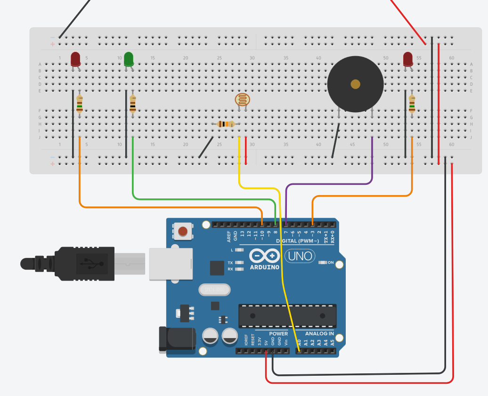
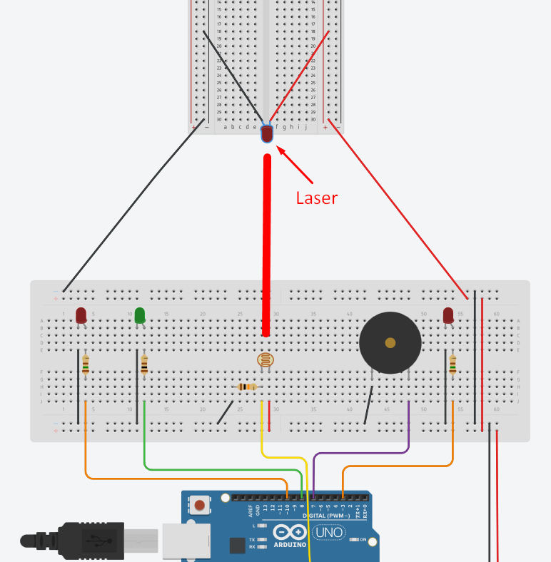

# Sensor de presença a partir de laser

**Integrantes do grupo:** José Jorge Moutinho Uliana, Maria Julia Damasceno Miranda Nolasco, Maria Clara Rebonato Delazari

## 1. Resumo
O projeto objetiva a construção de um alarme acionado por presença a partir do uso de sensor LDR, um LED, um emissor de som, um teclado matricial e uma placa microcontroladora Arduino Uno.

## 2. Descrição detalhada
Sistemas de segurança são muito úteis e seu uso, a partir da popularização do conceito de casas inteligentes, tem sido cada vez mais difundido. O presente projeto objetiva construir um  sistema simples de alarme acionado por presença.

A abordagem utilizada é a mais tradicional e conta, simplificadamente, com sensor LDR e um LED. Um LED alinhado a um LDR deve emitir um feixe de luz de modo a atingir o sensor. A detecção de presença se dá justamente pela interrupção de tal “sinal” (uma vez que um corpo opaco entre o LED e o LDR impede a chegada do feixe de luz ao sensor). Note que tal conceito de alarme é bastante conhecido por estar presente na obra cinematográfica “Entrapment” de 1999.

O funcionamento do alarme se dá pelo funcionamento do LDR, que varia sua resistência proporcionalmente à quantidade de luz recebida. Aproveitando tal propriedade, é possível obter uma tensão diferente para cada situação, permitindo acionamento de alarme (o som é emitido por meio de um buzzer) a partir de um dado limiar. O processamento da saída do sensor e o acionamento do alarme se dá por intermédio de uma placa microcontroladora Arduino Uno.

O sistema é controlado por meio de um teclado matricial. Quando o sistema é iniciado é preciso definir uma senha de quatro dígitos. A mesma senha é utilizada para ligar/desligar o alarme. As entradas fornecidas pelo o usuário são tratadas diretamente por software no Arduino por intermédio do módulo `Keypad`.

## 3. Lista de componentes
* Protoboard;
* Jumpers;
* LED Difuso 5mm:
    * 1 LED difuso vermelho;
    * 1 LED difuso verde;
    * 1 LED alto brilho azul ou vermelho;
* Resistor:  
    * 2 Resistores de 100 $\Omega$ / 1 Resistor de 150 $\Omega$ (para o LED);
    * 1 Resistor de $10 k\Omega$ (sensor LDR);
* Diodo Laser;
* Sensor de Luminosidade (LDR);
* Buzzer 5V 12mm;
* Arduino UNO;
* Teclado matricial.

## 4. Esquemáticos

**Figura 1:** Montagem do alarme na _breadboard_ sem o teclado matricial.

**Figura 2:** Montagem do alarme na _breadboard_ sem o teclado matricial mostrando o laser.

## 5. Créditos

A base do projeto (e as figuras 1 e 2) vieram [daqui](http://www.squids.com.br/arduino/index.php/projetos-arduino/projetos-basicos/116-projeto-31-alarme-com-laser-e-sensor-de-luz-ldr).